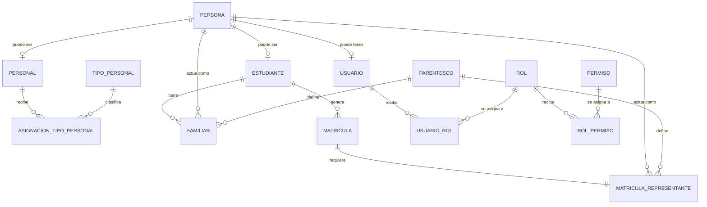

# Regla De Negocio: Persona Y Roles Operativos

## Objetivo

Definir la regla de negocio actual del sistema para `persona` y los papeles que puede asumir dentro de la operacion institucional y del proceso de matricula.

## Regla Principal

`persona` es la entidad base de identidad del sistema.

Una misma persona puede asumir uno o varios de estos papeles:

- `Estudiante`
- `Personal de la institucion`
- `Familiar`
- `Representante`
- `Usuario del sistema`

Estos papeles no son mutuamente excluyentes.

Ejemplos validos:

- Una persona puede ser `personal` y tambien `usuario`.
- Una persona puede ser `familiar` y ademas `representante`.
- Una persona puede ser `personal`, `representante` y `usuario` al mismo tiempo.

## Interpretacion Del Modelo

### 1. Persona como entidad base

La tabla `persona` concentra los datos generales de identificacion y datos personales reutilizables:

- cedula
- nombres
- apellidos
- telefonos
- correo
- sexo
- fecha de nacimiento
- instruccion
- profesion
- ocupacion
- habla ingles

No guarda por si sola el papel funcional de la persona.

### 2. Perfiles propios

Los siguientes papeles convierten a una persona en una entidad operativa propia:

- `estudiante`
- `personal`
- `usuario`

Cada uno se modela como una extension 1 a 1 respecto de `persona`.

### 3. Roles relacionales

Los siguientes papeles dependen de una relacion con otro registro:

- `familiar`
- `representante`

`familiar` existe en funcion de su relacion con un `estudiante`.

`representante` existe en funcion de su relacion con una `matricula`.

## Regla Funcional Actual

### Estudiante

Una persona puede convertirse en estudiante una sola vez.

Soporte actual:

- `estudiante.perid -> persona.perid`
- `UNIQUE (perid)` en `estudiante`

### Personal de la institucion

Una persona puede convertirse en personal una sola vez.

Soporte actual:

- `personal.perid -> persona.perid`
- `UNIQUE (perid)` en `personal`

### Tipo de personal

Una persona que ya es `personal` puede tener uno o varios tipos de personal.

Ejemplos:

- Docente
- Administrativo
- Directivo
- DECE

Soporte actual:

- `asignacion_tipo_personal.psnid -> personal.psnid`
- `asignacion_tipo_personal.tpid -> tipo_personal.tpid`
- `UNIQUE (psnid, tpid)`

### Familiar

Una persona puede ser familiar de uno o varios estudiantes.

Incluso puede aparecer varias veces para el mismo estudiante si el parentesco es diferente, porque la unicidad vigente es por:

- estudiante
- persona
- parentesco

Soporte actual:

- `familiar.estid -> estudiante.estid`
- `familiar.perid -> persona.perid`
- `familiar.pteid -> parentesco.pteid`
- `UNIQUE (estid, perid, pteid)`

Nota de transicion:

- `familiar` todavia conserva algunos campos personales por compatibilidad con la logica actual.
- El modelo objetivo del refactor es dejar esos datos en `persona` y usar `familiar` solo como tabla relacional.

### Representante

Una persona puede ser representante de una matricula.

En la logica actual el representante puede surgir de dos formas:

- seleccionando un familiar ya registrado del estudiante
- registrando un representante externo

Soporte actual:

- `matricula_representante.matid -> matricula.matid`
- `matricula_representante.perid -> persona.perid`
- `matricula_representante.pteid -> parentesco.pteid`
- `UNIQUE (matid)`

Eso significa que hoy el sistema exige un solo representante por matricula.

### Usuario

Una persona puede tener una sola cuenta de acceso.

Soporte actual:

- `usuario.perid -> persona.perid`
- `UNIQUE (perid)` en `usuario`

## Diagrama



## Restricciones Ya Bien Cubiertas

Las siguientes restricciones ya existen y son coherentes con la regla de negocio:

- Una persona no puede duplicarse como estudiante.
- Una persona no puede duplicarse como personal.
- Una persona no puede duplicarse como usuario.
- Un tipo de personal no puede repetirse para la misma persona de personal.
- Un estudiante no puede tener mas de un representante por matricula.
- El mismo familiar no puede repetirse para el mismo estudiante con el mismo parentesco.

## Restricciones Faltantes O Debiles

### Alta prioridad

#### 1. Validar fechas de personal

Hoy `personal` no impide que `psnfechasalida` sea menor que `psnfechacontratacion`.

Recomendacion:

```sql
ALTER TABLE personal
ADD CONSTRAINT ck_personal_fechas
CHECK (
    psnfechasalida IS NULL
    OR psnfechasalida >= psnfechacontratacion
);
```

#### 2. Evitar que el estudiante sea familiar de si mismo

La base actual no puede impedirlo con un `CHECK` simple porque `familiar.estid` apunta a `estudiante`, no directamente a `persona`.

Riesgo:

- una misma persona podria quedar registrada como familiar del mismo estudiante

Recomendacion:

- validar en la capa de aplicacion
- o crear un trigger en PostgreSQL

#### 3. Evitar que el estudiante sea su propio representante

Tampoco puede resolverse con un `CHECK` simple por la misma razon anterior.

Riesgo:

- una matricula podria terminar con el mismo alumno como representante

Recomendacion:

- validar en la capa de aplicacion
- o crear un trigger en PostgreSQL

### Prioridad media

#### 4. Definir si un familiar puede tener varios parentescos para el mismo estudiante

La restriccion actual `UNIQUE (estid, perid, pteid)` permite casos como:

- la misma persona como `Madre`
- y la misma persona como `Representante`

Eso puede ser correcto o incorrecto segun la regla institucional.

Opciones:

- Si es valido: dejar como esta.
- Si no es valido: cambiar a `UNIQUE (estid, perid)`.

#### 5. Definir si el representante debe ser siempre familiar o puede ser externo

La logica actual permite ambos casos, y eso es consistente con la interfaz de matricula.

Si la regla institucional cambia y el representante debe pertenecer obligatoriamente al grupo familiar, entonces faltaria una validacion adicional en aplicacion o trigger.

#### 6. Validar longitud o formato semantico de sexo, correo y telefonos

Hoy `persona` solo asegura presencia parcial y unicidad de cedula.

Puede ser suficiente para esta etapa, pero si se quiere mayor calidad de datos conviene definir:

- catalogo para sexo o genero
- validacion de correo
- validacion de telefono

## Recomendacion De Gobierno De Datos

La regla recomendable para el sistema es esta:

- `persona` es la base comun.
- `estudiante`, `personal` y `usuario` son perfiles formales.
- `familiar` y `representante` son roles contextuales.

Con esa regla, no conviene guardar un campo unico tipo `rol_persona` en `persona`, porque perderias la posibilidad de que una persona tenga multiples papeles simultaneos.

## Archivos Relacionados

- `database/scripts/01_catalogos.sql`
- `database/scripts/02_academico.sql`
- `database/scripts/03_personas.sql`
- `database/scripts/04_matriculacion.sql`
- `database/scripts/05_seguridad.sql`
- `database/scripts/06_triggers_reglas_negocio.sql`
- `database/scripts/sgeap.sql`
- `database/scripts/sgeap_triggers.sql`
- `app/models/MatriculationModel.php`

